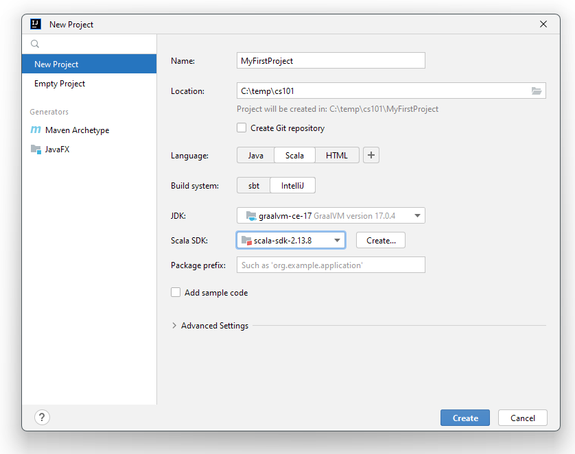

<style>
r { color: Red }
y { color: Yellow }
</style>

# Objectifs et donnée du laboratoire

Les objectifs de ce laboratoire sont :

1. se familiariser avec les outils utilisés dans le cours _101.1 Programmation impérative_;
1. faire vos premiers pas en _Scala_ (si ce n'est pas déjà fait);

La durée de laboratoire est de **2 périodes**. Vous aurez l'occasion durant ce premier laboratoire de créer votre premier projet _Scala_ et de faire connaissance avec l'environnement de développement _IntelliJ_.

# Partie 1 -- Les outils et la documentation

### Plateforme ISC Learn
Tous les cours en ISC utilisent la même plateforme pour assurer l'échange d'informations entre étudiant·e·s et professeur·e·s. Celle-ci est disponible sur le lien <https://isc.hevs.ch/learn> et vous devriez avoir reçu vos informations de login par email normalement.

Sur le cours _101.1 Programmation impérative_, vous trouverez des informations sur le cours, des anciens examens, les dernières nouvelles… Cette plate-forme est accessible tant à l'intérieur qu’à l'extérieur de la HES-SO Valais mais avec votre login.

## Tâche 1 : Exploration du site web
1. Trouvez les slides du cours du jours ainsi que la donnée de ce laboratoire au format informatique.
1. Téléchargez les fichiers `RoomCalc.scala` et `Input.scala` et retrouvez ces fichiers sur votre disque dur.

## Tâche 2 : Installation des outils
Pour ce cours, nous allons utiliser le langage Scala avec comme éditeur de code _IntelliJ_. Ces deux outils sont disponibles gratuitement en téléchargement pour les principaux systèmes d'exploitation Windows, MacOS ou Linux.

Voici comment procéder à l'installation :

1. Téléchargez et installez [IntelliJ Community Edition](https://www.jetbrains.com/idea/download) en suivant le lien <https://www.jetbrains.com/idea/download>. Durant l'installation, vous pouvez choisir quels plugins installer. Choisissez le **plugin Scala**.
1. Si vous avez loupé l'installation du plugin ou vous avez déjà une version d'IntelliJ fonctionnelle, vous pouvez télécharger et installer le plugin Scala en suivant les instructions suivantes (cherchez _"Scala"_ dans le menu des plugins)

# Partie 2 -- Premiers pas 
Maintenant que les outils sont installés, vous allez les utiliser pour écrire votre premier code.

## Tâche 3 : Créer votre premier projet

1. Lancez _IntelliJ_ et cliquez sur `File -> New -> Project`
1. Donnez lui un nom, comme par exemple `First project`
1. Choisissez où vous souhaitez mettre ce projet. 
1. Dans le langage, choisissez **Scala** et comme `Build system` mettez `IntelliJ`.

Vous devez ensuite choisir la version du JDK que vous souhaitez utiliser, c'est-à-dire quelle _machine virtuelle_ Java. Pour ce cours, nous utiliserons toutes et tous la même version. 

Pour cela, cliquez sur la flèche, puis `Download`. Choisissez la version `17` du JDK et comme machine  `GraalVM`. Pour le _Scala SDK_ (c'est-à-dire la version de Scala) choisissez **impérativement** une version 2.13 (e.g. 2.13.XX).

{height=8cm}

Merci de ne PAS choisir une version 3.0 de Scala car pour l'instant cette version est encore trop instable pour être utilisée dans notre cours. Avant de cliquer, vérifiez que cela ressemble à ce que vous voyez sur la figure \ref{fig_create}

Lorsque vous avez terminé, pressez sur le bouton `Create`. Votre premier projet devrait maintenant être créé. 

## Tâche 3 : Créer votre premier programme

1. Dans _IntelliJ_, faites un clic droit sur le dossier `src`, choisissez `new Scala class`
1. Donnez-lui comme nom `MyFirstCode`, choisissez le type `Object`
1. Complétez le code de manière à avoir *exactement* le même contenu que ci-dessous : 

    ```scala
    object MyFirstClass extends App{
      println("Hello World")
    }
    ```

1. Lancez le programme en cliquant sur la flèche verte.
1. Bravo ! vous avez exécuté votre premier programme `Scala`.

## Tâche 4 : Un petit peu plus compliqué

1. Créez un nouveau programme en faisant à nouveau clic droit sur le dossier `src`. Nommez-le `MyProgram`. \newpage
1. Complétez votre programme pour avoir **exactement** le code suivant.
   ```scala
    object MyProgram extends App {

      // Declares two values
      val toto: Int = 3
      val titi: Int = 4

      // Compute the sum of two values
      val theSum: Int = toto + titi

      // Display the result
      print("The sum is equal to : ")
      print(theSum)
    }
   ```
1. Peut-être que pendant l'écriture du code vous verrez messages d'erreur ou d'attention. Ne vous en inquiétez surtout pas **tant que vous n'avez pas terminé**. En effet, l'environnement de développement[^1] appelle en permanence le compilateur sur votre code pour vous aider à trouver d'éventuelles erreurs ou problèmes mais cela risque surtout de vous stresser au début. 
1. Exécutez maintenant votre programme
   1. Cliquez sur la flèche verte à gauche de la ligne contenant `objet MyProgram`.
   1. Vous verrez alors le résultat de votre programme affiché sur la console (la fenêtre au fond de l'écran), à savoir `The sum is equal to : 7`.
   1. Expérimentez en changeant le programme pour avoir une multiplication plutôt qu'une somme. Essayez également de modifier les chiffres pour voir ce qui se passe.

[^1]: _IntelliJ_ est une **IDE**, un acronyme signifiant **I**ntegrated **D**evelopment **E**nvironment, ou environnement de développement intégré.

## Tâche 5 -- Ajouter des fichiers
Comme vous l'avez constaté, il est possible d'avoir plusieurs fichiers _Scala_ dans le dossier `src` et donc plusieurs programmes différents que l'on peut lancer.

> Le dossier `src` dans un vrai projet comporte en général beaucoup de fichiers différents dans lesquels on range les différentes choses que l'on veut faire. Certains de ces fichiers peuvent être exécutés grâce à la petite flèche verte ou au menu `Run`. Nous verrons comment spécifier quels fichiers sont exécutables et ce qui les rend spécial dans un prochain labo.

1. Copiez les fichiers `RoomCalc.scala` et `Input.scala` dans le même répertoire que votre fichier`MyProgram.scala`
1. Regardez maintenant dans l’explorateur de projet pour vérifier que `RoomCalc.scala` et `Input.scala` sont bien ajoutés dans les fichiers source (`src`) de votre projet. 
1. Vous pouvez exécuter le programme `RoomCalc.scala` en cliquant avec le bouton droit sur le fichier `RoomCalc.scala` dans l’explorateur à gauche et en sélectionnant `Run ``RoomCalc```.
1. Vous pouvez ensuite cliquer dans la console et entrer les valeurs demandées.
1. Essayez de comprendre ce qui se passe dans le fichier. Bien que nous n’ayons pas vu ces éléments ensemble, vous ne pouvez pas encore comprendre toutes les finesses mais essayez d’imaginer à quoi peuvent server les différents éléments du programme.
1) Modifiez le fichier afin :
   1. D’afficher le message `Volume calculator, by John Doe` (en mettant votre nom à la place de _John Doe_) au début du programme.
   1. D’afficher le message `Goodbye and thank you` à la fin de l’exécution du programme.
   1. Essayez de calculer et afficher le volume en gallons impériaux (une mesure de volume anglaise). Utilisez pour cela l’information qu’un gallon vaut $0.00454609~m^3$.

## Tâche 4 – Votre consommation d’essence
1. Ajoutez une nouvelle classe à votre projet (`File -> New Class`) que vous nommerez `Fuel`.
2. En vous inspirant de l’exemple ci-dessus, faites un programme permettant de calculer votre consommation d’essence sur une certaine distance. Un exemple possible de ce qui est attendu pourrait-être :

   ```scala
   Liters / 100 km : 12
   Distance driven : 10
   You used : 1.2 liters of fuel.
   ```

## Tâche 5 – Flottaison d'une sphère

Nous voudrions écrire un programme qui permet de déterminer si une sphère en métal creuse flotte si on la plonge dans l'eau. Il doit être possible de choisir la matière qui compose la sphère, l'utilisateur devra donc saisir la masse volumique de cette matière (à titre d'exemple, la masse volumique de l'aluminium est de $2.6~[g/cm^3]$).

L'utilisateur doit donc saisir le **rayon** de la sphère (ici le rayon extérieur), **l'épaisseur de la surface** et la **masse volumique** du matériau utilisé. 

À partir de ces données, **calculez le volume intérieur de la sphère** ainsi que la **masse de la sphère creuse**. Si le rapport entre la masse et le volume est inférieur à 1, on peut considérer que l'objet flotte. Un exemple d'exécution nous donnerait :

```
Please enter outer sphere radius (in cm): 15
Please enter surface thickness (in cm): 1
Total outer sphere volume: 14137.1669411540 cm3
Enter material density (in g/cm3): 2
Total object density: 0.37392592592592594 => The object is floating
```

## Tâche 6 -- Quiz

Allez sur la page web du cours et complétez le premier quiz si vous ne l'avez pas encore fait. N'hésitez pas également à commenter le cours si vous avez vu des choses à modifier ! Merci

<!-- <y> Je sais pas vraiment s'il faut installer les outils command line ou pas... J'hésite franchement.</y>

<y>
1. GraalVM install depuis IntelliJ semble possible
--1. Explication dans intellij
```
cs java-home --jvm graalvm-java17  
cs java --jvm graalvm-java17 --setup
```

https://scala-cli.virtuslab.org/scripting/ ???

</y>

1. Allez sur la page (https://docs.scala-lang.org/getting-started/index.html)
1. Télécharger l'installateur `Scala` pour votre système d'exploitation. Cet installateur de commande s'appelle `Coursier` et c'est lui qui va gérer l'installation des outils pour pouvoir faire du `Scala`. 
1. Lancez une ligne de commande (TODO expliquer)
1. Dans la ligne de commande, tapez exactement la ligne suivante :

```
cs java --jvm 17
```

Cela va télécharger la machine virtuelle Java qui sert à exécuter les programmes écrits non seulement en Java (qui est un langage de programmation assez célèbre) mais également les programmes écrits en `Scala`, `Clojure`, `Kotlin`, `Groovy`, ... 

1. Vous devriez maintenant pouvoir commencer à faire du Scala. Pour vérifier que tout fonctionne correctement, tapez `scala` dans la ligne de commande. Vous devriez voir la chose suivante : 

```
Welcome to Scala 3.2.0 (11.0.15, Java OpenJDK 64-Bit Server VM).
Type in expressions for evaluation. Or try :help.

scala>
```

> L'outil `Coursier` est un programme mais qui n'a pas d'interface utilisateur. Vous allez en rencontrer beaucoup dans vos études et dans votre vie de programmeur·euse ! En réalité, la majorité des programmes sont comme cela, sans information visible. -->


